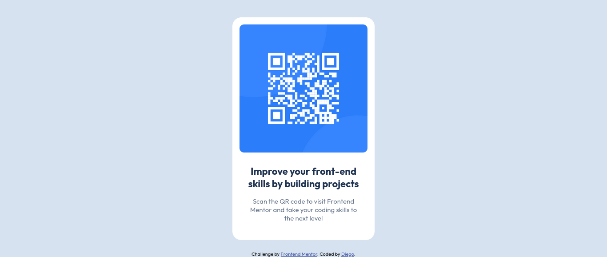

# Frontend Mentor - QR code component solution

This is my solution to the [QR code component challenge](https://www.frontendmentor.io/challenges/qr-code-component-iux_sIO_H) on Frontend Mentor. This challenge helped me practice basic HTML and CSS and improve my front-end skills.

## 📸 Screenshot

## 🔗 Links

- Solution URL: [Add your solution URL here](https://www.frontendmentor.io/solutions/...)
- Live Site URL: [Add your live site URL here](https://your-live-site-url.com)

## 🛠️ My process

### Built with

- Semantic HTML5 markup
- CSS custom properties
- Flexbox
- Mobile-first workflow

### What I learned

This was my first Frontend Mentor challenge. I learned how to:

- Build a simple, responsive card layout
- Center a component using Flexbox
- Use Google Fonts
- Apply consistent spacing, colors, and border-radius from a style guide
- Create a clean and organized file structure